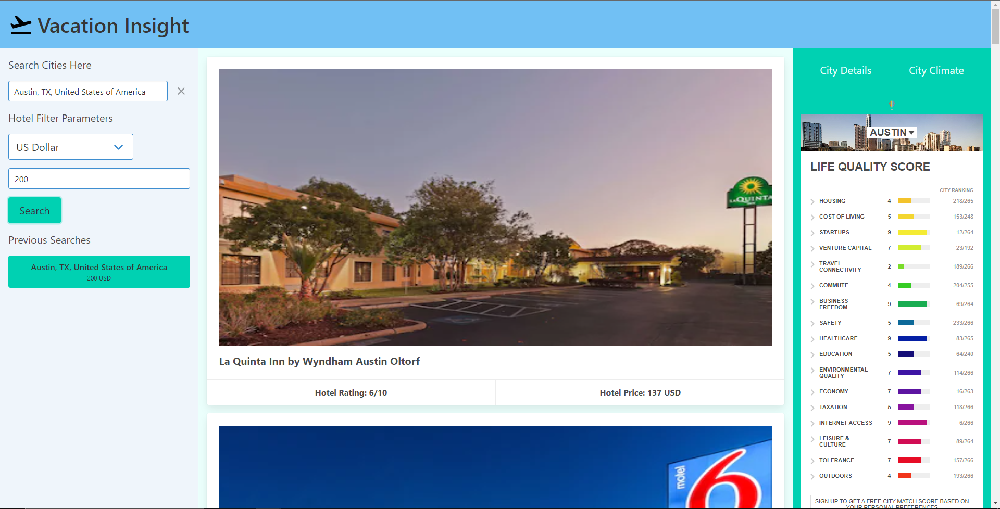

# Vacation Insight(Project One)
A one-stop shop to help you plan your next vacation

We aim to utilize simplicity and functionality to help our users save time and energy when planning their next vacation. 

Rather than employing a multi-platform search to choose your destination by researching hotels, climate, cost, and attractions, Vacation Insite will give users as surface level summary of their destination.

## Description

### Hotel API

For the hotels.com API we use a fetch within a fetch to accomplish a search of relevant user inputs. First, the API must be used to acquire the “gaiaID” which specifies the cities geographical region. Second, using that ID, as well as user input data, we can search the hotel API to return the desired results. Additionally, the results will display as a series of cards in the body of the main page.

### Bulma

For the CSS framework we used Bulma. Bulma offers a responsive layout for HTML elements and offers an intuitive way to implement them in the HTML file. The general layout of the HTML file consisted of a top row with the title of the project, and three columns below it. The first column contains input fields and buttons which relate to searching for hotels. The middle column contains cards that have details relating to the hotel search results. The third column contains details of the city and its climate. All of those columns, cards, and inputs were mainly styled with Bulma classes.

### Local Storage

The website grabs the 5 most recent unique search parameters from local storage and displays them on the first column of the page. The user can click on them and the website will make an API call to search for hotels with those parameters.

### Hotel Information Cards

### Autocomplete API
For the Autocomplete API I went with the Geoapify API. What it does is once you start typing it will show 5 results that start with the first 3 letters and onwards. Once you select one and click it. It will populate in the search bar and give you the city state and county. Then once you fill out the rest of the information it will populate the rest of the info for what area you picked.

### Widgets
For the widgets I used the Teleport API's Widgets. Those widgets will give you a lot of information on the city's data and also the weather. Also with those widgets if you want more info then you can click the link at the bottom of the widget and it will take you to their website where it can better inform you of certain info. You can also scroll through and select different cities.

## Website Preview

## Website Link
To view the Vacation Insight webpage, go to https://tony-coniglio.github.io/Project-One/ and start searching for some hotels.

## Authors
Payton Ray

Tony Coniglio

Allen Wang

Mark Bermejo

## Version History
* 0.1
    * Initial Release

## License

This project is licensed under the MIT License - see the <a href="LICENSE">LICENSE</a> file for details

## Acknowledgments
Geoapify API

Teleport API

Hotels.com API

Bulma

Google Material UI

Inspiration, code snippets, etc.
